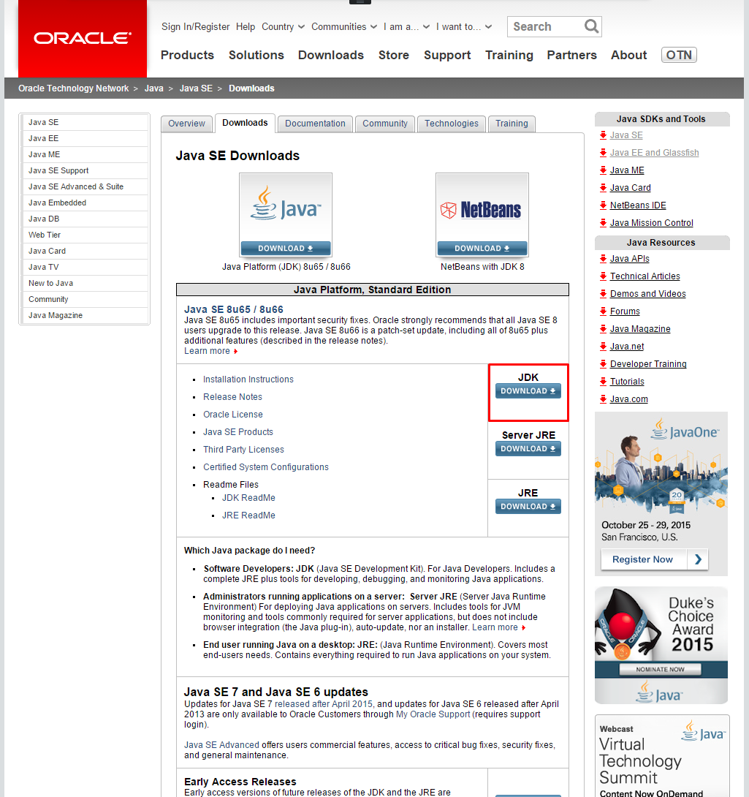

開発環境の構築手順 (Eclipse編)
==============================

※ 2015年11月時点の情報です。バージョンや URL など更新・変更されている可能性があります。

## Java 8 (JDK)

※ 既にインストール済の場合は、省略可

http://www.oracle.com/technetwork/java/javase/downloads/index.html

最新版をダウンロード。「Accept License Agreement」にチェックを入れて、自分のOSに応じて一つ選択

ダウンロードが完了したら、インストーラを起動
※ Windows の場合、デフォルトのインストール先が Program Files 配下になっているが、パスに空白が含まれるのを避けたほうがよい。推奨は `C:\opt\Java\jdk1.8.0_xx\`

続いて JRE(Java実行環境)のインストールが始まります。
※ Windows の場合、デフォルトのインストール先が Program Files 配下になっているが、パスに空白が含まれるのを避けたほうがよい。推奨は `C:\opt\Java\jre1.8.0_xx\`

## Java EE 7 SDK (+ Glassfish 4)

Java EE 7 SDK に Glassfish Server も同梱されている

http://www.oracle.com/technetwork/java/javaee/downloads/index.html

Web Profile 版ではなく、通常版(Full Platform版)を選択
次の画面で「Accept License Agreement」にチェックを入れてダウンロード
zip 形式でダウンロードされるので、適当な場所に解凍 (Windows の場合、推奨は `C:\opt\Java` の下。`Program Files` など空白が含まれるパスは避ける)

Glassfish 4.1

## Eclipse

通常の Eclipse (英語) または日本語化された Pleiades のどちらかをダウンロード。
2015年11月時点で最新バージョンは 4.5.1 Mars。
zip 形式でダウンロードされるので適当な場所へ解凍。(Windows の場合、こだわりが無ければ推奨は `C:\opt\` の下)

1. Eclipse(英語)

  http://www.eclipse.org/downloads/

  **Eclipse for Java EE Developers** をダウンロード (約250MB)

  ※ **Eclipse for Java Develpers** ではないので注意
  ※ 64bit / 32bit はPC のOSプロセッサに応じて選択。

  <!--  -->
  

2. Pleiades (日本語化パッケージ)

  http://mergedoc.osdn.jp/

  **Java Full Edition** (64bit or 32bit)をダウンロード (約1GB)

  ※ 64bit / 32bit はPC のOSプロセッサに応じて選択。

  

## Eclipse Plugin Glassfish Tools

1. Eclipse を起動する。起動時に入力する workspace は `C:\workspace` が推奨)
2. メニューバーの `Help` から `Eclipse マーケットプレース` を選択

  

3. 検索欄に `Glassfish` と入力し、Glassfish Tools をインストール

  * 「選択されたフィーチャーの確認」は、必須の Glassfish Tools と、任意で Java EE 7 Documentation を選択
  * 規約に同意し、先へ進む
  * インストール完了後、Eclipse の再起動を促されるので再起動する

## インストール済のJRE の追加

1. Eclipse のメニューから「ウィンドウ」>「設定」を開き「Java」>「インストール済のJRE」を開き「追加」ボタン
2. JRE Type は Standard VM を選択し「次へ」
3. JRE Home の入力欄の右の「Directory...」から インストールした JDK のパスを指定し「完了」
4. 追加された JRE(JDK) の行のチェックボックスを ON にし、デフォルトの JRE に指定し「適用」または「OK」

## Eclipse サーバランタイム設定の追加 (Glassfish)

1.  Eclipse のメニューから「ウィンドウ」>「設定」を開き「サーバー」>「ランタイム環境」を開き「追加」ボタン
2. 「GlassFish 4」を選択し「新規ローカルサーバを作成」のチェックを入れて「次へ」
3. 「新規サーバーランタイム環境」ウィザードで以下ように入力し「次へ」

  <dt>名前<dd>GlassFish 4.1
  <dt>サーバールート<dd>`<Java EE SDK のインストールフォルダ>/glassfish4/glassfish`
  <dt>JDK<dd>`<インストールしたJDK>`

4. デフォルト値のまま完了 ※パスワードも不要

## プロジェクト作成

1. 「ファイル」>「新規」>「動的Webアプリケーション」を選択

  

2. 「新機動的Webプロジェクト」ウィザードが表示されるので、以下の内容を入力し「完了」

  <dt>プロジェクト名<dd>OedoTicketsManager (適当)
  <dt>プロジェクト・ロケーション<dd>デフォルト・ロケーションを利用
  <dt>ターゲット・ランタイム<dd>GlassFish 4.1
  <dt>動的Webモジュールバージョン (サーブレットバージョン)<dd>3.1

  

## Glassfish Server の起動

1. 「サーバー」ビューで「GlassFish 4 at localhost [domain1]」を右クリックし「デバッグ」

  

2. ファイアーフォールの警告が出ることがあるが、「アクセスを許可する」で問題ない
3. 起動後、Webブラウザで http://localhost:8080 にアクセスし、GlassFish サーバが起動出来ていることを確認

  
