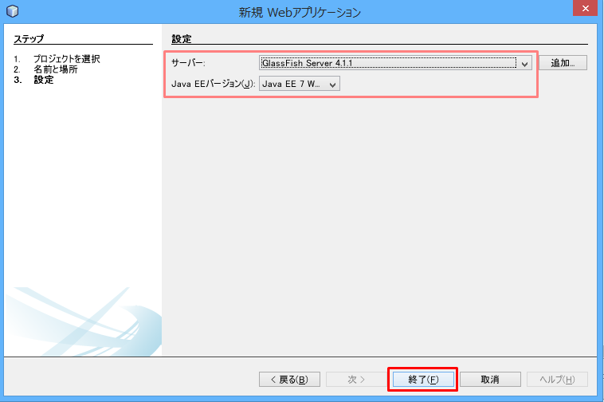

開発環境の構築手順 (NetBeans編)
==============================

※ 2015年11月時点の情報です。バージョンや URL など更新・変更されている可能性があります。

参考：NetBeans IDE 8.1のインストール手順 (https://netbeans.org/community/releases/81/install_ja.html)

## Java 8 (JDK)

※ 既にインストール済の場合は、省略可

http://www.oracle.com/technetwork/java/javase/downloads/index.html

最新版をダウンロード。「Accept License Agreement」にチェックを入れて、自分のOSに応じて一つ選択

ダウンロードが完了したら、インストーラを起動
※ Windows の場合、デフォルトのインストール先が Program Files 配下になっているが、パスに空白が含まれるのを避けたほうがよい。推奨は `C:\opt\Java\jdk1.8.0_xx\`

続いて JRE(Java実行環境)のインストールが始まります。
※ Windows の場合、デフォルトのインストール先が Program Files 配下になっているが、パスに空白が含まれるのを避けたほうがよい。推奨は `C:\opt\Java\jre1.8.0_xx\`

## NetBeans

2015年11月時点で最新バージョンは 8.1。
zip 形式でダウンロードされるので適当な場所へ解凍。(Windows の場合、こだわりが無ければ推奨は `C:\opt\` の下)

https://netbeans.org/downloads/

**Java EE 版** をダウンロード (約190 MB)

※ IDE の言語は任意。ここでは日本語。
※ プラットフォームはご使用の PC のOSに応じて選択。

<!--  -->

インストーラを起動

1. IDE とともにインストールするアプリケーションサーバーは GlassFissh Server のみ選択し、次へ (インストールサイズ：約635 MB)

  

2. ライセンス契約条件に同意し、次へ
3. NetBeans IDE のインストール先と、NetBeans IDE用のJDKのパスを指定して、次へ

  * NetBeans IDE用のNetBeans IDE のインストール先はデフォルトのままでも構わないが、Windows の場合は空白を避けて `C:\opt\NetBeans8.1` のようにすることを推奨

  * JDK のパスは先にインストールした JDK のパスを指定する

  

4. GlassFish のインストール先とGlassFishアプリケーションサーバー用の JDK のパスを指定して次へ

  * GlassFish のインストール先は、Windows の場合は空白を避けて、`C:opt\Java\glassfish-4.1.1` のようにすることを推奨

  * GlassFishアプリケーションサーバー用の JDK のパスは先にインストールした JDK のパスを指定する

  

5. NetBeans IDE用のNetBeans IDE のインストール先と GlassFish のインストール先を確認し、インストール開始

  * 「更新の確認」はチェックを入れて有効にしておくことを推奨

6. 数分後、インストール完了。スタートメニューなどから起動を確認

  

## Java Web アプリケーションの作成と動作確認

参考: [Getting Started with Contexts and Dependency Injection and JSF 2.x - NetBeans IDE Tutorial](https://netbeans.org/kb/docs/javaee/cdi-intro.html)

試しに、新しく Java Web アプリケーションを作成してみます。

1. メニューバーの「ファイル」から「新規プロジェクト...」を選択
2. カテゴリ「Java Web」から「Webアプリケーション」を選択して次

  

3. プロジェクト名とプロジェクトの場所を入力して次

  <dt>プロジェクト名</dt><dd>SampleWebApplication (適当)</dd>
  <dt>プロジェクトの場所</dt><dd>C:\repos\OedoDevelopsersClub (適当)</dd>

  

4. サーバーと設定を以下のように選択し、次

  <dt>サーバー<dt><dd>GlassFish Server 4.1.1</dd>
  <dt>Java EE バージョン</dt><dd>Java EE 7 Web</dd>

  

5. フレームワークは JavaServer Faces を選択し、デフォルトの構成のまま、終了

  * JPA の実装としては GlassFish サーバで EclipseLink がデフォルトで提供されるため、Hibernate は不要

  

6. プロジェクトの作成が完了したら、ツールバーの再生マークのボタンをクリックし、サーバ(GlassFish Server)を起動させる

  

7. サーバの起動が完了したら、自動で既定のブラウザが起動し、index ページが表示される

  
