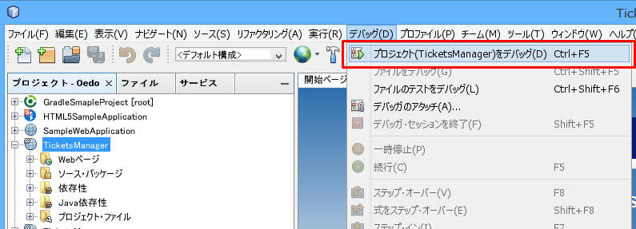

開発環境の構築手順 (NetBeans編)
==============================

※ 2015年11月時点の情報です。バージョンや URL など更新・変更されている可能性があります。

参考：NetBeans IDE 8.1のインストール手順 (https://netbeans.org/community/releases/81/install_ja.html)

## Java 8 (JDK)

※ 既にインストール済の場合は、省略可

http://www.oracle.com/technetwork/java/javase/downloads/index.html

最新版をダウンロード。「Accept License Agreement」にチェックを入れて、自分のOSに応じて一つ選択

ダウンロードが完了したら、インストーラを起動
※ Windows の場合、デフォルトのインストール先が Program Files 配下になっているが、パスに空白が含まれるのを避けたほうがよい。推奨は `C:\opt\Java\jdk1.8.0_xx\`

続いて JRE(Java実行環境)のインストールが始まります。
※ Windows の場合、デフォルトのインストール先が Program Files 配下になっているが、パスに空白が含まれるのを避けたほうがよい。推奨は `C:\opt\Java\jre1.8.0_xx\`

## NetBeans

2015年11月時点で最新バージョンは 8.1。
zip 形式でダウンロードされるので適当な場所へ解凍。(Windows の場合、こだわりが無ければ推奨は `C:\opt\` の下)

https://netbeans.org/downloads/

**Java EE 版** をダウンロード (約190 MB)

※ IDE の言語は任意。ここでは日本語。
※ プラットフォームはご使用の PC のOSに応じて選択。

<!--  -->

インストーラを起動

1. IDE とともにインストールするアプリケーションサーバーは GlassFissh Server のみ選択し、次へ (インストールサイズ：約635 MB)

  

2. ライセンス契約条件に同意し、次へ
3. NetBeans IDE のインストール先と、NetBeans IDE用のJDKのパスを指定して、次へ

  * NetBeans IDE用のNetBeans IDE のインストール先はデフォルトのままでも構わないが、Windows の場合は空白を避けて `C:\opt\NetBeans8.1` のようにすることを推奨

  * JDK のパスは先にインストールした JDK のパスを指定する

  

4. GlassFish のインストール先とGlassFishアプリケーションサーバー用の JDK のパスを指定して次へ

  * GlassFish のインストール先は、Windows の場合は空白を避けて、`C:opt\Java\glassfish-4.1.1` のようにすることを推奨

  * GlassFishアプリケーションサーバー用の JDK のパスは先にインストールした JDK のパスを指定する

  

5. NetBeans IDE用のNetBeans IDE のインストール先と GlassFish のインストール先を確認し、インストール開始

  * 「更新の確認」はチェックを入れて有効にしておくことを推奨

6. 数分後、インストール完了。スタートメニューなどから起動を確認

  

## Java Web アプリケーション プロジェクトのクローンと動作確認

 1. コマンドプロント(Windows)、またはターミナル(Mac) などのコンソールを開く
 2. プロジェクトを作成する場所へ cd コマンドで移動する (ここでは `C:\repos\OedoDevelopersClub` とする)  
 3. コマンド `git clone https://github.com/OedoDevelopersClub/TicketsManager.git` を入力し実行する

   * プロンプトでパスワード入力を促されるので、GitHub のログインパスワードを入力する
     - ニ要素認証 (Two-factor authentication) を有効にしている場合はトークン ([https://github.com/settings/tokens](https://github.com/settings/tokens)) を入力する

   参考： GitHub ページ ([https://github.com/OedoDevelopersClub/TicketsManager](https://github.com/OedoDevelopersClub/TicketsManager)) の以下の枠内が clone URL (クローンの対象を示す URI)

   

 4. NetBeans を開き、メニューバーの「ファイル」から「新規プロジェクト」を選択
 5. カテゴリ「Maven」を選択し、プロジェクト「既存のPOMを使用したプロジェクト」を選択して、「次」をクリックし「終了」
 6. ウィザード「プロジェクトを開く」が表示されるのでクローンしたフォルダを選択し、プロジェクトを開く

   

 7. インポートしたプロジェクトを右クリックし「プロパティ」を選択

   

 8. カテゴリ「ビルド」>「実行」を選択し、「サーバー」「Java EE バージョン」を以下のように選択し、OK

   <dt>サーバー</dt><dd>GlassFish Server 4.1.1</dd>
   <dt>Java EE バージョン</dt><dd>Java EE 7 Web</dd>
   <dt>コンテキストパス</dt><dd>/TicketManager (デフォルト)</dd>

   

 9. メニューバー「デバッグ」から「プロジェクト(TicketManger)をデバッグ」を選択する
 10. プロジェクトがビルドされ、ブラウザが起動し、`http://localhost:8080/TicketsManager/` が開かれ初期画面が表示されれば成功

## Java DB ローカルデータベースの作成

 1. 「サービス」タブを開き、データベース > Java DB を右クリックし、「データベースの作成」を選択
 2. 「Java DB データベース作成」ウィザードが表示されるので、以下の情報を入力し、「OK」

   <dt>データベース名</dt><dd>ticket</dd>
   <dt>ユーザー名</dt><dd>oedo</dd>
   <dt>パスワード</dt><dd>※いつものやつ</dd>
   <dt>パスワードの確認</dt><dd>※パスワードと同じ</dd>

   ※ データベースの場所はデフォルト

   

 3. データベース ticket が作成され、接続文字列が表示されることを確認

   

## Java Web アプリケーション プロジェクトの作成と動作確認

**※ 新規でプロジェクトを作成する場合の手順 (既に開発中のプロジェクトは 「Java Web アプリケーション プロジェクトのクローンと動作確認」を参照)**

参考: [Getting Started with Contexts and Dependency Injection and JSF 2.x - NetBeans IDE Tutorial](https://netbeans.org/kb/docs/javaee/cdi-intro.html)

新しく Java Web アプリケーション (Maven) を作成ます。

1. メニューバーの「ファイル」から「新規プロジェクト...」を選択
2. カテゴリ「Maven」から「Webアプリケーション」を選択して次

  

3. プロジェクト名など、以下のように入力して次

  <dt>プロジェクト名</dt><dd>TicketsManager</dd>
  <dt>プロジェクトの場所</dt><dd>C:\repos\OedoDevelopsersClub (適当)</dd>
  <dt>グループID</dt><dd>net.oekora</dd>
  <dt>バージョン</dt><dd>0.1</dd>
  <dt>パッケージ</dt><dd>(なし)</dd>

  

4. サーバーと設定を以下のように選択し、次

  <dt>サーバー<dt><dd>GlassFish Server 4.1.1</dd>
  <dt>Java EE バージョン</dt><dd>Java EE 7 Web</dd>

  

5. プロジェクトの作成が完了したら、メニューバーの「デバッグ」から「Project(TicketsManager)をデバッグ」を選択し、サーバ(GlassFish Server)を起動させる

  

6. サーバの起動が完了したら、自動で既定のブラウザが起動し、index ページが表示される

  

## java DB データベース接続情報 (永続性ユニット) の作成

 1. メニューバー「ファイル」から「新規ファイル」を選択する
 2. プロジェクトは「TicketManager」を選択し、カテゴリ「持続性」から「持続性ユニット」を選択し、次へ

   

 3. 「New 持続性ユニット」ウィザードで、以下のように入力し、「終了」

   <dt>持続性ユニット名</dt><dd>TicketsManagerPU</dd>
   <dt>永続性プロバイダ</dt><dd>Eclipse Link (JPA 2.1)</dd>
   <dt>データ・ソース</dt><dd>java:app/jdbc/ticket</dd>

   - データ・ソースは「新しいデータ・ソース」で作成する

     <dt>JNDI名</dt><dd>jdbc/ticket</dd>
     <dt>データベース接続</dt><dd>jdbc:derby://localhost:1527//ticket (「Java DB ローカルデータベースの作成」で作成したデータベース接続)</dd>

        

   <dt>Java Transaction API の使用</dt><dd>ON</dd>
   <dt>表生成戦略</dt><dd>ドロップして作成</dd>

     

 4. `src/main/resources/META-INF` に `persistence.xml` が作成されることを確認する

   
