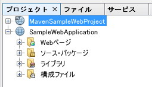

# プログラミングに最適なフォントの使用

Windows の場合、デフォルトフォントは「MS ゴシック」などになっているので、「メイリオ」や等幅は「Consolas」に変更するのがおすすめ

## NetBeans

  1. メニューバー「ツール」→「オプション」
  2. 「フォントと色」を選択し、「フォント」の右の「...」から設定

  ### エディタ以外のフォントのアンチエイリアスを有効にする

  1. <NetBeans インストールフォルダ>/etc/netbeans.conf を開く
  2. netbeans_default_options の値の最後に  `-J-Dswing.aatext=true -J-Dawt.useSystemAAFontSettings=on ` を追加し、NetBeans を再起動
  設定例：
          netbeans_default_options="-J-client -J-Xss2m -J-Xms32m -J-Dapple.laf.useScreenMenuBar=true -J-Dapple.awt.graphics.UseQuartz=true -J-Dsun.java2d.noddraw=true -J-Dsun.java2d.dpiaware=true -J-Dsun.zip.disableMemoryMapping=true -J-Dswing.aatext=true -J-Dawt.useSystemAAFontSettings=on"

  プロジェクトビューなどのフォントも見やすくなる
  

  参考：[[Fedora19] NetBeans7.4 Editor Setting Fontのアンチエイリアス(Anti-Aliasing) : J-Linuxer](http://jlinuxer.dip.jp/?p=1107)

## Eclipse

  1. メニューバー「ウィンドウ」→「設定」
  2. 「一般」>「外観」>「色とフォント」を選択
  3. Java 等のエディタテキストを選択し「編集」から設定
